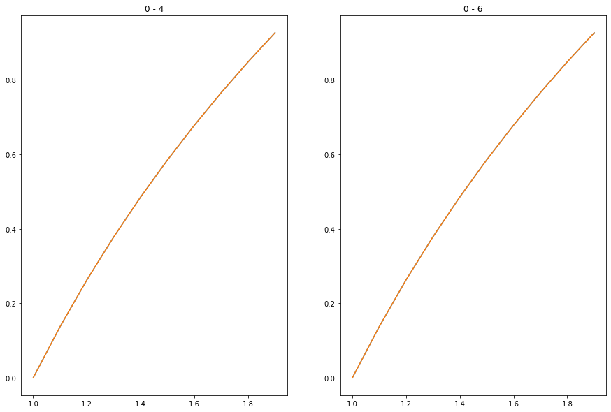
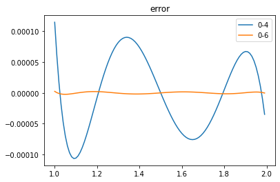
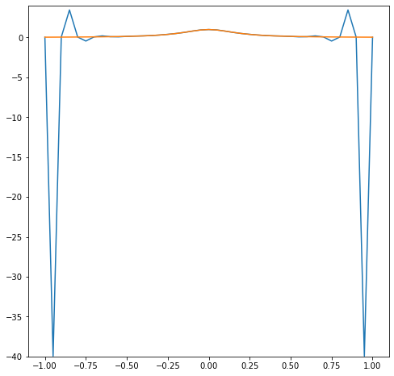
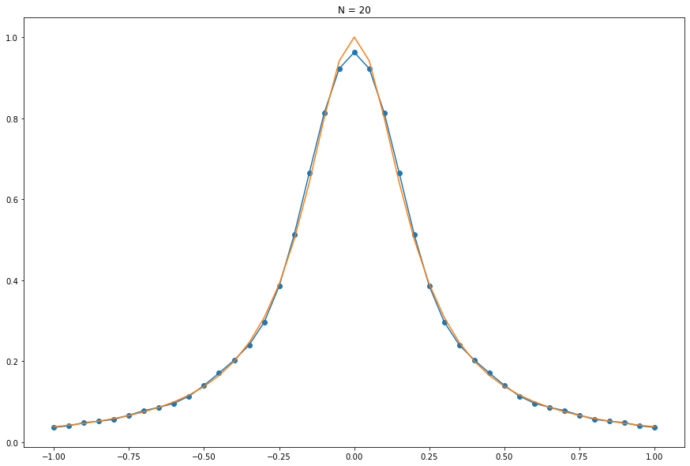
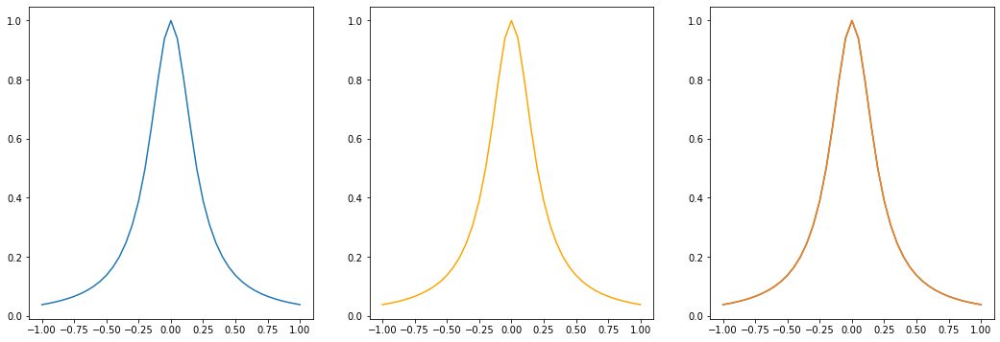
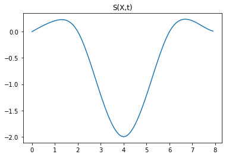
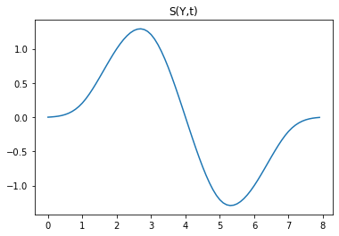
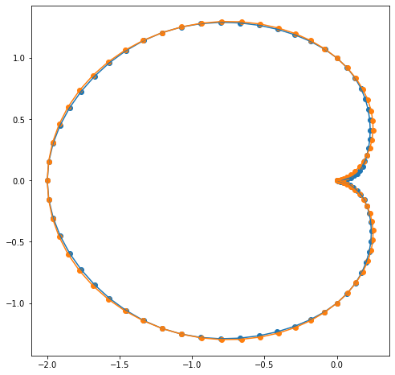

<h1 align = "center">计算物理第二次作业</h1>


<h4 align = "center">2000011476 胡逸</h4>


# 1.

## 高斯消元法解线性方程组


```python
import numpy as np

A = np.array([[0.05, 0.07, 0.06, 0.05, 0.23], [0.07, 0.10, 0.08, 0.07, 0.32],
              [0.06, 0.08, 0.10, 0.09, 0.33], [0.05, 0.07, 0.09, 0.10, 0.31]])


def GEM(A):
    '''
    return solution x of A[:, :-1] * x = A[:, -1] through Gauss Elimination Method
    '''
    n = len(A)
    # A是增广矩阵

    for i in range(n):
        if i == 0: A[i] = A[i] / A[i, i]
        else:
            assert A[i - 1, i - 1] == 1
            for j in range(i):
                A[i] = A[i] - A[j] * A[i, j]
                A[i] = A[i] / A[i, i]
    # 将上三角增广矩阵通过初等变换转化为对角矩阵
    for i in range(n - 2, -1, -1):
        for j in range(n - 1, i, -1):
            A[i] = A[i] - A[j] * A[i, j]
    return A[:, n]


print('对增广矩阵：\n', A, '\n 通过高斯消元法求解，结果如下：')
print('\n 方程解为：\n', GEM(A))
```

    对增广矩阵：
     [[0.05 0.07 0.06 0.05 0.23]
     [0.07 0.1  0.08 0.07 0.32]
     [0.06 0.08 0.1  0.09 0.33]
     [0.05 0.07 0.09 0.1  0.31]] 
     通过高斯消元法求解，结果如下：
    
     方程解为：
     [1. 1. 1. 1.]


## Cholesky 方法解线性方程组


```python
import numpy as np

A = np.array([[0.05, 0.07, 0.06, 0.05, 0.23], [0.07, 0.10, 0.08, 0.07, 0.32],
              [0.06, 0.08, 0.10, 0.09, 0.33], [0.05, 0.07, 0.09, 0.10, 0.31]])

def Cholesky(A):
    '''
    return solution x of A[:,:-1] * x = A[:,-1] through Cholesky decomposition
    '''
    # cholesky decomposition
    n = len(A)
    H = A[:, :-1]
    b = A[:, -1]
    # H是系数矩阵，b是常数项矩阵
    for j in range(1, n + 1):
        for k in range(1, j):
            H[j - 1, j - 1] -= H[j - 1, k - 1]**2
        H[j - 1, j - 1] = H[j - 1, j - 1]**(1 / 2)
        for i in range(j + 1, n + 1):
            for k in range(1, j):
                H[i - 1, j - 1] -= H[i - 1, k - 1] * H[j - 1, k - 1]
            H[i - 1, j - 1] = H[i - 1, j - 1] / H[j - 1, j - 1]
    for i in range(n):
        for j in range(i + 1, n):
            H[i, j] = 0

    # 此时 H 是一个下三角矩阵
    print("\n 分解所得上三角矩阵为：\n", H.T)
    L = H
    # 求 L y = b
    L = np.concatenate((H, np.ones((n, 1))), axis=1)
    for i in range(n):
        L[i][n] = b[i]
    for i in range(n):
        if i == 0: L[i] = L[i] / L[i, i]
        else:
            assert L[i - 1, i - 1] == 1
            for j in range(i):
                L[i] = L[i] - L[j] * L[i, j]
                L[i] = L[i] / L[i, i]
    y = L[:, n]

    # 下面求 H.T x = y
    Lt = H.T
    Lt = np.concatenate((Lt, np.ones((n, 1))), axis=1)
    for i in range(n):
        Lt[i][n] = y[i]
    for i in range(n):
        Lt[i] = Lt[i] / Lt[i, i]
    for i in range(n - 2, -1, -1):
        for j in range(n - 1, i, -1):
            Lt[i] = Lt[i] - Lt[j] * Lt[i, j]

    return Lt[:, n]

print('对增广矩阵：\n', A ,'\n 通过Cholesky方法求解，结果如下：')
print('\n 方程解为：', Cholesky(A))
```

    对增广矩阵：
     [[0.05 0.07 0.06 0.05 0.23]
     [0.07 0.1  0.08 0.07 0.32]
     [0.06 0.08 0.1  0.09 0.33]
     [0.05 0.07 0.09 0.1  0.31]] 
     通过Cholesky方法求解，结果如下：
    
     分解所得上三角矩阵为：
     [[ 2.23606798e-01  3.13049517e-01  2.68328157e-01  2.23606798e-01]
     [ 0.00000000e+00  4.47213595e-02 -8.94427191e-02 -3.10316769e-16]
     [ 0.00000000e+00  0.00000000e+00  1.41421356e-01  2.12132034e-01]
     [ 0.00000000e+00  0.00000000e+00  0.00000000e+00  7.07106781e-02]]
    
     方程解为： [1. 1. 1. 1.]


# 2.对$f(x)=cos(x^2)$进行三次条样插值
## (a) 边界条件为$x_0 = 0$和$x_2 = 0.9$处二次导数值为0

首先编写代码来进行后续验算，解析部分在代码之后。


```python
import math
import numpy as np

def h(j: int, x = [0, 0.6, 0.9]):
    return x[j + 1] - x[j]


def mu_(j: int):
    return h(j - 1) / (h(j - 1) + h(j))


def lambda_(j: int):
    return h(j) / (h(j - 1) + h(j))


def d(j: int, y: list):
    return 6 * (y[j - 1] / (h(j - 1) * (h(j - 1) + h(j))) + y[j + 1] /
              (h(j) * (h(j - 1) + h(j))) - y[j] / (h(j - 1) * h(j)))


def get_matrix(y):
    # n-1个方程组成的三对角矩阵
    n = len(y) - 1
    # A是增广矩阵
    A = np.zeros((n + 1,n + 2))
    for j in range(1,n):
        A[j-1][j-1] = mu_(j)
        A[j-1][j] = 2
        A[j-1][j+1] = lambda_(j)
        A[j-1,-1] = d(j,y)
    return A
```


```python
def add_boundary(A, y):
    n = len(y) - 1
    A[n - 1][0] = 1
    A[n][2] = 1
    return A

def matrix(y):
    return add_boundary(get_matrix(y),y)


y = [math.cos(0), math.cos(0.36), math.cos(0.81)]

matr = matrix(y)
print(matr)
M = np.linalg.solve(matr[:, :-1], matr[:, -1])
print(M)
```

    [[ 0.66666667  2.          0.33333333 -4.76326228]
     [ 1.          0.          0.          0.        ]
     [ 0.          0.          1.          0.        ]]
    [ 0.         -2.38163114  0.        ]


```python
def A(j):
    return (y[j + 1] - y[j]) / h(j) - h(j) / 6 * (M[j + 1] - M[j])


def B(j):
    return y[j] - M[j] * h(j)**2 / 6


print('A0=', A(0), ', A1=', A(1))
print('B0=', B(0), ',B1=', B(1))
print(M[1])
print(M[1] / (6 * h(0)))
print(M[1] / (6 * h(1)))

```

    A0= 0.13132448675784164 , A1= -0.9404095260679346
    B0= 1.0 ,B1= 0.9716212907721273
    -2.3816311396128365
    -0.6615642054480102
    -1.32312841089602


接下来解析地计算插值后得到的f(x).

n=2,首先我们从一阶导连续的条件得到：
$$
\mu_j M_{j-1}+2M_j+\lambda_j M_{j+1}=d_j\quad   ,j=1
$$
代入数据得：
$$
2M_j=-4.76326228
$$
$$
M_j=-2.38163114\quad,j=1\\
\therefore S(x)
=\begin{cases}
    -0.6615642\cdot x^3+0.1313244\cdot x+ 1& 0\leq x\leq 0.6\\
    1.3231284\cdot (x-0.9)^3-0.9404095\cdot (x-0.6)+ 0.9716213 & 0.6\leq x\leq 0.9\\
\end{cases}
$$

## (b) 

利用$f(x)=\cos(x^2)$得到$x_0=0$和$x_2=0.9$端点处的一次导数值。

$$f'(x)=-2x\sin(x^2)$$

因而，边界条件为：
$$f'(0)=0,\quad f'(0.9)=-1.8\cdot\sin(0.81)$$
$$
S'(x_0)=-\frac{M_0}{2}h_0+A_0=0\\
S'(x_2)=\frac{M_2}{2}h_1+A_1=-1.8\cdot\sin(0.81)\\
$$
同时，由异界导连续条件有：
$$
\mu_1 M_{0}+2M_1+\lambda_1 M_{2}=d_1
$$
其中：
$$
h_0=0.6,\quad h_1=0.3,\\
A_0=\frac{\cos(0.6^2)-\cos(0)}{0.6}-\frac{0.6}{6}(M_1-M_0),\\ A_1=\frac{\cos(0.9^2)-\cos(0.6^2)}{0.3}-\frac{0.3}{6}(M_2-M_1)
$$
因而$M_0,M_1,M_2$满足的线性方程组为：
$$
\begin{cases}
    -0.2M_0-0.1M_1=\frac{1-\cos(0.36)}{0.6}=0.10683862\\
    0.05M_1+0.1M_2=-1.8\sin(0.81)-\frac{\cos(0.81)-\cos(0.36)}{0.3}=-0.48238894\\
    \frac{2}{3}M_0+2M_1+\frac{1}{3}M_2=6\cdot(\frac{1}{0.54}+\frac{\cos(0.81)}{0.27}-\frac{\cos(0.36)}{0.18})=-4.76326228
\end{cases}
$$
上述线性方程组的解为：
$$
\begin{cases}
M_0=0.39886365\\
M_1=-1.86611358\\
M_2=-3.89083266\\
\end{cases}
$$
代回$A,B$表达式可知：
$$
A_0=0.11965910\\
A_1=-0.72009202\\
B_0=0.97606818\\
B_1=0.96388853\\
$$

$$
S(x)=
\begin{cases}
-0.1107955(x-0.6)^3-0.5183649x^3+0.1196591x+0.9760682\quad x\in [0,0.6]\\
1.0367297(x-0.9)^3-2.1615737(x-0.6)^3-0.7200920(x-0.6)+0.96388853\quad x\in [0.6,0.9]
\end{cases}
$$

# 3. Chebyshev 多项式展开$\log_2(x)$


```python
import math
import numpy as np

start = 1
end = 2
step = 0.1

def f(x):
    return np.log2(1/2*x+1.5)


def T(m, x):
    if m == 0: return 1
    elif m == 1: return x
    else: return 2 * x * T(m - 1, x) - T(m - 2, x)


def delta(x, y):
    if x == y: return 1
    else: return 0


def c(N, m):
    return (2 - delta(0, m)) / N * np.sum([
        math.cos((m * math.pi *
                  (k + 0.5)) / N) * f(math.cos(math.pi * (k + 0.5) / N))
        for k in range(N)
    ])


def S(x, N):
    return np.sum([c(N, m) * T(m, x) for m in range(N)])

def transform_S(x,a,b,N):
    return S(2 * (x-a)/(b-a)-1,N)

```


```python
import matplotlib.pyplot as plt

plt.figure(figsize=(15, 10))

for i,N in enumerate([5,7]):
    plt.subplot(121+i)
    xs = []
    ys = []
    y_expected = []
    x = start
    while x <= end:
        xs.append(x)
        ys.append(transform_S(x,1,2,N))
        y_expected.append(np.log2(x))
        x += step

    plt.plot(xs, ys)
    plt.plot(xs, y_expected)
    plt.title('0 - ' + str(N-1))

print(ys)
print(y_expected)
    
plt.show()

```

    [2.4434387201012874e-06, 0.1375030585551525, 0.2630364531047573, 0.3785111194246006, 0.4854250201836586, 0.5849625007211564, 0.6780735120398902, 0.7655351444545313, 0.847995471894916, 0.9259997068643171]
    [0.0, 0.13750352374993502, 0.26303440583379406, 0.3785116232537301, 0.4854268271702421, 0.5849625007211566, 0.6780719051126382, 0.7655347463629776, 0.8479969065549506, 0.9259994185562238]



    


接下来对误差进行作图。


```python
from cProfile import label
import matplotlib.pyplot as plt

start = 1
end = 2
step = 0.01


for i, N in enumerate([5, 7]):
    xs = []
    ys = []
    y_expected = []
    delta_y = []
    x = start
    while x <= end:
        xs.append(x)
        ys.append(transform_S(x, 1, 2, N))
        y_expected.append(np.log2(x))
        delta_y.append((transform_S(x, 1, 2, N) - np.log2(x)))
        x += step

    plt.plot(xs, delta_y,label='0-'+str(N-1))
    plt.title('error')
    plt.legend()


plt.show()

```


​    

​    


从上图可以看出随展开阶数从0-4升高到0-6，误差明显减小，减少约两个数量级。

且误差呈现震荡形式。

# 4. Runge效应
## a. 拉格朗日内插


```python
import numpy as np
n = 20
xlist = np.arange(-1,1.1,0.1)

def f(x):
    return 1/(1 + 25 * x ** 2)

def L(j,x):
    return np.prod([(x - xlist[m])/(xlist[j]-xlist[m]) for m in np.delete(range(n+1),j)])

def P(n,x):
    return np.sum([f(xlist[i])*L(i,x) for i in range(n+1)])
```


```python
import matplotlib.pyplot as plt

plt.figure(figsize=(8,8))


xl = []
yl = []
y_expected = []
delta_y = []

for x in np.arange(-1,1.05,0.05):
    xl.append(x)
    yl.append(P(n,x))
    y_expected.append(f(x))
    delta_y.append(abs(f(x)-P(n,x)))

plt.ylim(-40,4)
plt.plot(xl, yl)
plt.plot(xl, y_expected)


plt.show()
```


​    

​    


```python
import pandas as pd

df = pd.DataFrame(columns=['x', 'f(x)','P(x)','delta_y'])

for i in range(len(xl)):
    df = df.append({'x':'{:.2f}'.format(xl[i]), 'f(x)': y_expected[i],'P(x)':yl[i],'delta_y':'{:.1e}'.format(delta_y[i])}, ignore_index=True)


df
```


<div>
<style scoped>
    .dataframe tbody tr th:only-of-type {
        vertical-align: middle;
    }

    .dataframe tbody tr th {
        vertical-align: top;
    }
    
    .dataframe thead th {
        text-align: right;
    }
</style>
<table border="1" class="dataframe">
  <thead>
    <tr style="text-align: right;">
      <th></th>
      <th>x</th>
      <th>f(x)</th>
      <th>P(x)</th>
      <th>delta_y</th>
    </tr>
  </thead>
  <tbody>
    <tr>
      <th>0</th>
      <td>-1.00</td>
      <td>0.038462</td>
      <td>0.038462</td>
      <td>0.0e+00</td>
    </tr>
    <tr>
      <th>1</th>
      <td>-0.95</td>
      <td>0.042440</td>
      <td>-39.952449</td>
      <td>4.0e+01</td>
    </tr>
    <tr>
      <th>2</th>
      <td>-0.90</td>
      <td>0.047059</td>
      <td>0.047059</td>
      <td>3.7e-14</td>
    </tr>
    <tr>
      <th>3</th>
      <td>-0.85</td>
      <td>0.052459</td>
      <td>3.454958</td>
      <td>3.4e+00</td>
    </tr>
    <tr>
      <th>4</th>
      <td>-0.80</td>
      <td>0.058824</td>
      <td>0.058824</td>
      <td>8.7e-15</td>
    </tr>
    <tr>
      <th>5</th>
      <td>-0.75</td>
      <td>0.066390</td>
      <td>-0.447052</td>
      <td>5.1e-01</td>
    </tr>
    <tr>
      <th>6</th>
      <td>-0.70</td>
      <td>0.075472</td>
      <td>0.075472</td>
      <td>2.4e-15</td>
    </tr>
    <tr>
      <th>7</th>
      <td>-0.65</td>
      <td>0.086486</td>
      <td>0.202423</td>
      <td>1.2e-01</td>
    </tr>
    <tr>
      <th>8</th>
      <td>-0.60</td>
      <td>0.100000</td>
      <td>0.100000</td>
      <td>8.7e-16</td>
    </tr>
    <tr>
      <th>9</th>
      <td>-0.55</td>
      <td>0.116788</td>
      <td>0.080660</td>
      <td>3.6e-02</td>
    </tr>
    <tr>
      <th>10</th>
      <td>-0.50</td>
      <td>0.137931</td>
      <td>0.137931</td>
      <td>4.2e-16</td>
    </tr>
    <tr>
      <th>11</th>
      <td>-0.45</td>
      <td>0.164948</td>
      <td>0.179763</td>
      <td>1.5e-02</td>
    </tr>
    <tr>
      <th>12</th>
      <td>-0.40</td>
      <td>0.200000</td>
      <td>0.200000</td>
      <td>2.2e-16</td>
    </tr>
    <tr>
      <th>13</th>
      <td>-0.35</td>
      <td>0.246154</td>
      <td>0.238446</td>
      <td>7.7e-03</td>
    </tr>
    <tr>
      <th>14</th>
      <td>-0.30</td>
      <td>0.307692</td>
      <td>0.307692</td>
      <td>1.1e-16</td>
    </tr>
    <tr>
      <th>15</th>
      <td>-0.25</td>
      <td>0.390244</td>
      <td>0.395093</td>
      <td>4.8e-03</td>
    </tr>
    <tr>
      <th>16</th>
      <td>-0.20</td>
      <td>0.500000</td>
      <td>0.500000</td>
      <td>2.2e-16</td>
    </tr>
    <tr>
      <th>17</th>
      <td>-0.15</td>
      <td>0.640000</td>
      <td>0.636755</td>
      <td>3.2e-03</td>
    </tr>
    <tr>
      <th>18</th>
      <td>-0.10</td>
      <td>0.800000</td>
      <td>0.800000</td>
      <td>0.0e+00</td>
    </tr>
    <tr>
      <th>19</th>
      <td>-0.05</td>
      <td>0.941176</td>
      <td>0.942490</td>
      <td>1.3e-03</td>
    </tr>
    <tr>
      <th>20</th>
      <td>0.00</td>
      <td>1.000000</td>
      <td>1.000000</td>
      <td>5.6e-16</td>
    </tr>
    <tr>
      <th>21</th>
      <td>0.05</td>
      <td>0.941176</td>
      <td>0.942490</td>
      <td>1.3e-03</td>
    </tr>
    <tr>
      <th>22</th>
      <td>0.10</td>
      <td>0.800000</td>
      <td>0.800000</td>
      <td>1.1e-16</td>
    </tr>
    <tr>
      <th>23</th>
      <td>0.15</td>
      <td>0.640000</td>
      <td>0.636755</td>
      <td>3.2e-03</td>
    </tr>
    <tr>
      <th>24</th>
      <td>0.20</td>
      <td>0.500000</td>
      <td>0.500000</td>
      <td>1.7e-16</td>
    </tr>
    <tr>
      <th>25</th>
      <td>0.25</td>
      <td>0.390244</td>
      <td>0.395093</td>
      <td>4.8e-03</td>
    </tr>
    <tr>
      <th>26</th>
      <td>0.30</td>
      <td>0.307692</td>
      <td>0.307692</td>
      <td>5.6e-17</td>
    </tr>
    <tr>
      <th>27</th>
      <td>0.35</td>
      <td>0.246154</td>
      <td>0.238446</td>
      <td>7.7e-03</td>
    </tr>
    <tr>
      <th>28</th>
      <td>0.40</td>
      <td>0.200000</td>
      <td>0.200000</td>
      <td>5.3e-16</td>
    </tr>
    <tr>
      <th>29</th>
      <td>0.45</td>
      <td>0.164948</td>
      <td>0.179763</td>
      <td>1.5e-02</td>
    </tr>
    <tr>
      <th>30</th>
      <td>0.50</td>
      <td>0.137931</td>
      <td>0.137931</td>
      <td>1.3e-15</td>
    </tr>
    <tr>
      <th>31</th>
      <td>0.55</td>
      <td>0.116788</td>
      <td>0.080660</td>
      <td>3.6e-02</td>
    </tr>
    <tr>
      <th>32</th>
      <td>0.60</td>
      <td>0.100000</td>
      <td>0.100000</td>
      <td>3.5e-15</td>
    </tr>
    <tr>
      <th>33</th>
      <td>0.65</td>
      <td>0.086486</td>
      <td>0.202423</td>
      <td>1.2e-01</td>
    </tr>
    <tr>
      <th>34</th>
      <td>0.70</td>
      <td>0.075472</td>
      <td>0.075472</td>
      <td>1.3e-14</td>
    </tr>
    <tr>
      <th>35</th>
      <td>0.75</td>
      <td>0.066390</td>
      <td>-0.447052</td>
      <td>5.1e-01</td>
    </tr>
    <tr>
      <th>36</th>
      <td>0.80</td>
      <td>0.058824</td>
      <td>0.058824</td>
      <td>7.8e-14</td>
    </tr>
    <tr>
      <th>37</th>
      <td>0.85</td>
      <td>0.052459</td>
      <td>3.454958</td>
      <td>3.4e+00</td>
    </tr>
    <tr>
      <th>38</th>
      <td>0.90</td>
      <td>0.047059</td>
      <td>0.047059</td>
      <td>7.4e-13</td>
    </tr>
    <tr>
      <th>39</th>
      <td>0.95</td>
      <td>0.042440</td>
      <td>-39.952449</td>
      <td>4.0e+01</td>
    </tr>
    <tr>
      <th>40</th>
      <td>1.00</td>
      <td>0.038462</td>
      <td>0.038462</td>
      <td>1.4e-11</td>
    </tr>
  </tbody>
</table>
</div>


## (b) chebyshev


```python
import math
import numpy as np

start = -1
end = 1
step = 0.05


def f(x):
    return 1 / (1 + 25 * x**2)


def T(m, x):
    if m == 0: return 1
    elif m == 1: return x
    else: return 2 * x * T(m - 1, x) - T(m - 2, x)


def delta(x, y):
    if x == y: return 1
    else: return 0


def c(N, m):
    return (2 - delta(0, m)) / N * np.sum([
        math.cos((m * math.pi *
                  (k + 0.5)) / N) * f(math.cos(math.pi * (k + 0.5) / N))
        for k in range(N)
    ])


def S(x, N):
    return np.sum([c(N, m) * T(m, x) for m in range(N)])


def transform_S(x, a, b, N):
    return S(2 * (x - a) / (b - a) - 1, N)

```


```python
import matplotlib.pyplot as plt

plt.figure(figsize=(15, 10))

N = 20

xs = []
ys = []
y_expected = []
delta_y = []
x = start
while x <= end:
    x = round(x,2)
    xs.append(x)
    ys.append(transform_S(x, -1, 1, N))
    y_expected.append(f(x))
    delta_y.append(abs(ys[-1] - y_expected[-1]))
    x += step

plt.plot(xs, ys)
plt.scatter(xs, ys)
plt.plot(xs, y_expected)
plt.title('N = ' + str(N))

plt.show()

```


​    

​    


```python
import pandas as pd

df = pd.DataFrame(columns=['x', 'f(x)', 'S(x)', 'delta_y'])

for i in range(len(xl)):
    df = df.append(
        {
            'x': '{:.2f}'.format(xs[i]),
            'f(x)': y_expected[i],
            'S(x)': ys[i],
            'delta_y': delta_y[i]
        },
        ignore_index=True)

df.style.hide_index()

df

```


<div>
<style scoped>
    .dataframe tbody tr th:only-of-type {
        vertical-align: middle;
    }

    .dataframe tbody tr th {
        vertical-align: top;
    }
    
    .dataframe thead th {
        text-align: right;
    }
</style>
<table border="1" class="dataframe">
  <thead>
    <tr style="text-align: right;">
      <th></th>
      <th>x</th>
      <th>f(x)</th>
      <th>S(x)</th>
      <th>delta_y</th>
    </tr>
  </thead>
  <tbody>
    <tr>
      <th>0</th>
      <td>-1.00</td>
      <td>0.038462</td>
      <td>0.037016</td>
      <td>0.001446</td>
    </tr>
    <tr>
      <th>1</th>
      <td>-0.95</td>
      <td>0.042440</td>
      <td>0.040849</td>
      <td>0.001592</td>
    </tr>
    <tr>
      <th>2</th>
      <td>-0.90</td>
      <td>0.047059</td>
      <td>0.048685</td>
      <td>0.001626</td>
    </tr>
    <tr>
      <th>3</th>
      <td>-0.85</td>
      <td>0.052459</td>
      <td>0.052261</td>
      <td>0.000198</td>
    </tr>
    <tr>
      <th>4</th>
      <td>-0.80</td>
      <td>0.058824</td>
      <td>0.056713</td>
      <td>0.002110</td>
    </tr>
    <tr>
      <th>5</th>
      <td>-0.75</td>
      <td>0.066390</td>
      <td>0.067169</td>
      <td>0.000779</td>
    </tr>
    <tr>
      <th>6</th>
      <td>-0.70</td>
      <td>0.075472</td>
      <td>0.078252</td>
      <td>0.002780</td>
    </tr>
    <tr>
      <th>7</th>
      <td>-0.65</td>
      <td>0.086486</td>
      <td>0.086534</td>
      <td>0.000047</td>
    </tr>
    <tr>
      <th>8</th>
      <td>-0.60</td>
      <td>0.100000</td>
      <td>0.096413</td>
      <td>0.003587</td>
    </tr>
    <tr>
      <th>9</th>
      <td>-0.55</td>
      <td>0.116788</td>
      <td>0.114126</td>
      <td>0.002663</td>
    </tr>
    <tr>
      <th>10</th>
      <td>-0.50</td>
      <td>0.137931</td>
      <td>0.140523</td>
      <td>0.002592</td>
    </tr>
    <tr>
      <th>11</th>
      <td>-0.45</td>
      <td>0.164948</td>
      <td>0.171124</td>
      <td>0.006176</td>
    </tr>
    <tr>
      <th>12</th>
      <td>-0.40</td>
      <td>0.200000</td>
      <td>0.202763</td>
      <td>0.002763</td>
    </tr>
    <tr>
      <th>13</th>
      <td>-0.35</td>
      <td>0.246154</td>
      <td>0.240175</td>
      <td>0.005979</td>
    </tr>
    <tr>
      <th>14</th>
      <td>-0.30</td>
      <td>0.307692</td>
      <td>0.296333</td>
      <td>0.011360</td>
    </tr>
    <tr>
      <th>15</th>
      <td>-0.25</td>
      <td>0.390244</td>
      <td>0.385335</td>
      <td>0.004909</td>
    </tr>
    <tr>
      <th>16</th>
      <td>-0.20</td>
      <td>0.500000</td>
      <td>0.511895</td>
      <td>0.011895</td>
    </tr>
    <tr>
      <th>17</th>
      <td>-0.15</td>
      <td>0.640000</td>
      <td>0.663854</td>
      <td>0.023854</td>
    </tr>
    <tr>
      <th>18</th>
      <td>-0.10</td>
      <td>0.800000</td>
      <td>0.812606</td>
      <td>0.012606</td>
    </tr>
    <tr>
      <th>19</th>
      <td>-0.05</td>
      <td>0.941176</td>
      <td>0.922073</td>
      <td>0.019103</td>
    </tr>
    <tr>
      <th>20</th>
      <td>0.00</td>
      <td>1.000000</td>
      <td>0.962410</td>
      <td>0.037590</td>
    </tr>
    <tr>
      <th>21</th>
      <td>0.05</td>
      <td>0.941176</td>
      <td>0.922073</td>
      <td>0.019103</td>
    </tr>
    <tr>
      <th>22</th>
      <td>0.10</td>
      <td>0.800000</td>
      <td>0.812606</td>
      <td>0.012606</td>
    </tr>
    <tr>
      <th>23</th>
      <td>0.15</td>
      <td>0.640000</td>
      <td>0.663854</td>
      <td>0.023854</td>
    </tr>
    <tr>
      <th>24</th>
      <td>0.20</td>
      <td>0.500000</td>
      <td>0.511895</td>
      <td>0.011895</td>
    </tr>
    <tr>
      <th>25</th>
      <td>0.25</td>
      <td>0.390244</td>
      <td>0.385335</td>
      <td>0.004909</td>
    </tr>
    <tr>
      <th>26</th>
      <td>0.30</td>
      <td>0.307692</td>
      <td>0.296333</td>
      <td>0.011360</td>
    </tr>
    <tr>
      <th>27</th>
      <td>0.35</td>
      <td>0.246154</td>
      <td>0.240175</td>
      <td>0.005979</td>
    </tr>
    <tr>
      <th>28</th>
      <td>0.40</td>
      <td>0.200000</td>
      <td>0.202763</td>
      <td>0.002763</td>
    </tr>
    <tr>
      <th>29</th>
      <td>0.45</td>
      <td>0.164948</td>
      <td>0.171124</td>
      <td>0.006176</td>
    </tr>
    <tr>
      <th>30</th>
      <td>0.50</td>
      <td>0.137931</td>
      <td>0.140523</td>
      <td>0.002592</td>
    </tr>
    <tr>
      <th>31</th>
      <td>0.55</td>
      <td>0.116788</td>
      <td>0.114126</td>
      <td>0.002663</td>
    </tr>
    <tr>
      <th>32</th>
      <td>0.60</td>
      <td>0.100000</td>
      <td>0.096413</td>
      <td>0.003587</td>
    </tr>
    <tr>
      <th>33</th>
      <td>0.65</td>
      <td>0.086486</td>
      <td>0.086534</td>
      <td>0.000047</td>
    </tr>
    <tr>
      <th>34</th>
      <td>0.70</td>
      <td>0.075472</td>
      <td>0.078252</td>
      <td>0.002780</td>
    </tr>
    <tr>
      <th>35</th>
      <td>0.75</td>
      <td>0.066390</td>
      <td>0.067169</td>
      <td>0.000779</td>
    </tr>
    <tr>
      <th>36</th>
      <td>0.80</td>
      <td>0.058824</td>
      <td>0.056713</td>
      <td>0.002110</td>
    </tr>
    <tr>
      <th>37</th>
      <td>0.85</td>
      <td>0.052459</td>
      <td>0.052261</td>
      <td>0.000198</td>
    </tr>
    <tr>
      <th>38</th>
      <td>0.90</td>
      <td>0.047059</td>
      <td>0.048685</td>
      <td>0.001626</td>
    </tr>
    <tr>
      <th>39</th>
      <td>0.95</td>
      <td>0.042440</td>
      <td>0.040849</td>
      <td>0.001592</td>
    </tr>
    <tr>
      <th>40</th>
      <td>1.00</td>
      <td>0.038462</td>
      <td>0.037016</td>
      <td>0.001446</td>
    </tr>
  </tbody>
</table>
</div>


## c. 三次条样函数内插


```python
import math
import numpy as np

def h(j: int, x = [x for x in np.arange(-1, 1.1, 0.1)]):
    return x[j + 1] - x[j]


def mu_(j: int):
    return h(j - 1) / (h(j - 1) + h(j))


def lambda_(j: int):
    return h(j) / (h(j - 1) + h(j))


def d(j: int, y: list):
    return 6 * (y[j - 1] / (h(j - 1) * (h(j - 1) + h(j))) + y[j + 1] /
                (h(j) * (h(j - 1) + h(j))) - y[j] / (h(j - 1) * h(j)))


def get_matrix(y):
    # n-1个方程组成的三对角矩阵
    n = len(y) - 1
    # A是增广矩阵
    A = np.zeros((n + 1, n + 2))
    for j in range(1, n):
        A[j - 1][j - 1] = mu_(j)
        A[j - 1][j] = 2
        A[j - 1][j + 1] = lambda_(j)
        A[j - 1, -1] = d(j, y)
    return A


def add_boundary(A, y):
    n = len(y) - 1
    # 1处二阶导
    A[n - 1][-2] = 1
    A[n - 1][-1] = -925 / 4394
    # -1处二阶导
    A[n][0] = 1
    A[n][-1] = 925 / 4394
    return A


def matrix(y):
    return add_boundary(get_matrix(y), y)


def f(x):
    return 1 / (1 + 25 * x**2)


xlist = [round(x,2) for x in np.arange(-1, 1.1, 0.1)]
ylist = [f(x) for x in xlist]
L = matrix(ylist)

def process(L):
    M0 = L[-1][-1]
    Mn = L[-2][-1]
    L = np.concatenate((L[0:-2, 1:-2], L[0:-2, -1].reshape(-1,1)), axis=1)
    L[:,-1][0] -= 0.5 * M0
    L[:,-1][-1]-= 0.5 * Mn
    return L,M0,Mn

L,M0,Mn = process(L)
M = np.concatenate(([M0],GEM(L),[Mn]))
print(M)
```

    [  0.21051434   0.30513616   0.46939351   0.7473675    1.26921641
       2.21740642   4.34391653   7.78093278  15.30158313  -4.3718807
     -57.81406035  -4.37187791  15.301572     7.78097451   4.34376071
       2.21798795   1.2670461    0.7554672    0.43916501   0.41795045
      -0.21051434]


```python
def S(x, M, xlist=xlist):

    def A(j):
        return (ylist[j + 1] - ylist[j]) / h(j) - h(j) / 6 * (M[j + 1] - M[j])

    def B(j):
        return ylist[j] - M[j] * h(j)**2 / 6

    # 确定x落在哪个区间
    for i, xi in enumerate(xlist):
        if i == len(xlist) - 1:
            j = len(xlist) - 1
            break
        else:
            if x >= round(xi, 1) and x <= round(xlist[i+1],1):
                j = i
                break
    return -M[j] / (6 * h(j)) * (x - xlist[j + 1])**3 + M[j + 1] / (6 * h(j)) * (x - xlist[j])**3 + A(j) * (x - xlist[j]) + B(j)

```


```python
xl = []
yl = []
y_expected = []
delta_y = []

for x in [round(x, 2) for x in np.arange(-1, 1.05, 0.05)]:
    xl.append(x)
    yl.append(S(x, M))
    y_expected.append(f(x))
    delta_y.append(abs(f(x) - S(x, M)))

plt.figure(figsize=(18,6))

plt.subplot(131)
plt.plot(xl, yl)

plt.subplot(132)
plt.plot(xl, y_expected, color='orange')

plt.subplot(133)
plt.plot(xl, yl)
plt.plot(xl, y_expected)

plt.show()
```


​    

​    


```python
import pandas as pd

df = pd.DataFrame(columns=['x', 'f(x)', 'P(x)', 'delta_y'])

for i in range(len(xl)):
    df = df.append(
        {
            'x': '{:.2f}'.format(xl[i]),
            'f(x)': y_expected[i],
            'P(x)': yl[i],
            'delta_y': '{:.2e}'.format(delta_y[i])
        },
        ignore_index=True)

df.round({'x': 2})
df.style.hide_index()

df
```


<div>
<style scoped>
    .dataframe tbody tr th:only-of-type {
        vertical-align: middle;
    }

    .dataframe tbody tr th {
        vertical-align: top;
    }
    
    .dataframe thead th {
        text-align: right;
    }
</style>
<table border="1" class="dataframe">
  <thead>
    <tr style="text-align: right;">
      <th></th>
      <th>x</th>
      <th>f(x)</th>
      <th>P(x)</th>
      <th>delta_y</th>
    </tr>
  </thead>
  <tbody>
    <tr>
      <th>0</th>
      <td>-1.00</td>
      <td>0.038462</td>
      <td>0.038462</td>
      <td>0.00e+00</td>
    </tr>
    <tr>
      <th>1</th>
      <td>-0.95</td>
      <td>0.042440</td>
      <td>0.042438</td>
      <td>2.42e-06</td>
    </tr>
    <tr>
      <th>2</th>
      <td>-0.90</td>
      <td>0.047059</td>
      <td>0.047059</td>
      <td>0.00e+00</td>
    </tr>
    <tr>
      <th>3</th>
      <td>-0.85</td>
      <td>0.052459</td>
      <td>0.052457</td>
      <td>1.92e-06</td>
    </tr>
    <tr>
      <th>4</th>
      <td>-0.80</td>
      <td>0.058824</td>
      <td>0.058824</td>
      <td>0.00e+00</td>
    </tr>
    <tr>
      <th>5</th>
      <td>-0.75</td>
      <td>0.066390</td>
      <td>0.066387</td>
      <td>2.90e-06</td>
    </tr>
    <tr>
      <th>6</th>
      <td>-0.70</td>
      <td>0.075472</td>
      <td>0.075472</td>
      <td>2.78e-17</td>
    </tr>
    <tr>
      <th>7</th>
      <td>-0.65</td>
      <td>0.086486</td>
      <td>0.086475</td>
      <td>1.10e-05</td>
    </tr>
    <tr>
      <th>8</th>
      <td>-0.60</td>
      <td>0.100000</td>
      <td>0.100000</td>
      <td>0.00e+00</td>
    </tr>
    <tr>
      <th>9</th>
      <td>-0.55</td>
      <td>0.116788</td>
      <td>0.116786</td>
      <td>1.94e-06</td>
    </tr>
    <tr>
      <th>10</th>
      <td>-0.50</td>
      <td>0.137931</td>
      <td>0.137931</td>
      <td>0.00e+00</td>
    </tr>
    <tr>
      <th>11</th>
      <td>-0.45</td>
      <td>0.164948</td>
      <td>0.164865</td>
      <td>8.38e-05</td>
    </tr>
    <tr>
      <th>12</th>
      <td>-0.40</td>
      <td>0.200000</td>
      <td>0.200000</td>
      <td>0.00e+00</td>
    </tr>
    <tr>
      <th>13</th>
      <td>-0.35</td>
      <td>0.246154</td>
      <td>0.246268</td>
      <td>1.14e-04</td>
    </tr>
    <tr>
      <th>14</th>
      <td>-0.30</td>
      <td>0.307692</td>
      <td>0.307692</td>
      <td>1.11e-16</td>
    </tr>
    <tr>
      <th>15</th>
      <td>-0.25</td>
      <td>0.390244</td>
      <td>0.389420</td>
      <td>8.24e-04</td>
    </tr>
    <tr>
      <th>16</th>
      <td>-0.20</td>
      <td>0.500000</td>
      <td>0.500000</td>
      <td>0.00e+00</td>
    </tr>
    <tr>
      <th>17</th>
      <td>-0.15</td>
      <td>0.640000</td>
      <td>0.643169</td>
      <td>3.17e-03</td>
    </tr>
    <tr>
      <th>18</th>
      <td>-0.10</td>
      <td>0.800000</td>
      <td>0.800000</td>
      <td>2.22e-16</td>
    </tr>
    <tr>
      <th>19</th>
      <td>-0.05</td>
      <td>0.941176</td>
      <td>0.938866</td>
      <td>2.31e-03</td>
    </tr>
    <tr>
      <th>20</th>
      <td>0.00</td>
      <td>1.000000</td>
      <td>1.000000</td>
      <td>0.00e+00</td>
    </tr>
    <tr>
      <th>21</th>
      <td>0.05</td>
      <td>0.941176</td>
      <td>0.938866</td>
      <td>2.31e-03</td>
    </tr>
    <tr>
      <th>22</th>
      <td>0.10</td>
      <td>0.800000</td>
      <td>0.800000</td>
      <td>4.44e-16</td>
    </tr>
    <tr>
      <th>23</th>
      <td>0.15</td>
      <td>0.640000</td>
      <td>0.643169</td>
      <td>3.17e-03</td>
    </tr>
    <tr>
      <th>24</th>
      <td>0.20</td>
      <td>0.500000</td>
      <td>0.500000</td>
      <td>2.22e-16</td>
    </tr>
    <tr>
      <th>25</th>
      <td>0.25</td>
      <td>0.390244</td>
      <td>0.389420</td>
      <td>8.24e-04</td>
    </tr>
    <tr>
      <th>26</th>
      <td>0.30</td>
      <td>0.307692</td>
      <td>0.307692</td>
      <td>2.22e-16</td>
    </tr>
    <tr>
      <th>27</th>
      <td>0.35</td>
      <td>0.246154</td>
      <td>0.246268</td>
      <td>1.14e-04</td>
    </tr>
    <tr>
      <th>28</th>
      <td>0.40</td>
      <td>0.200000</td>
      <td>0.200000</td>
      <td>1.11e-16</td>
    </tr>
    <tr>
      <th>29</th>
      <td>0.45</td>
      <td>0.164948</td>
      <td>0.164864</td>
      <td>8.40e-05</td>
    </tr>
    <tr>
      <th>30</th>
      <td>0.50</td>
      <td>0.137931</td>
      <td>0.137931</td>
      <td>5.55e-17</td>
    </tr>
    <tr>
      <th>31</th>
      <td>0.55</td>
      <td>0.116788</td>
      <td>0.116787</td>
      <td>9.50e-07</td>
    </tr>
    <tr>
      <th>32</th>
      <td>0.60</td>
      <td>0.100000</td>
      <td>0.100000</td>
      <td>2.78e-17</td>
    </tr>
    <tr>
      <th>33</th>
      <td>0.65</td>
      <td>0.086486</td>
      <td>0.086472</td>
      <td>1.47e-05</td>
    </tr>
    <tr>
      <th>34</th>
      <td>0.70</td>
      <td>0.075472</td>
      <td>0.075472</td>
      <td>2.78e-17</td>
    </tr>
    <tr>
      <th>35</th>
      <td>0.75</td>
      <td>0.066390</td>
      <td>0.066401</td>
      <td>1.09e-05</td>
    </tr>
    <tr>
      <th>36</th>
      <td>0.80</td>
      <td>0.058824</td>
      <td>0.058824</td>
      <td>2.78e-17</td>
    </tr>
    <tr>
      <th>37</th>
      <td>0.85</td>
      <td>0.052459</td>
      <td>0.052405</td>
      <td>5.35e-05</td>
    </tr>
    <tr>
      <th>38</th>
      <td>0.90</td>
      <td>0.047059</td>
      <td>0.047059</td>
      <td>6.94e-18</td>
    </tr>
    <tr>
      <th>39</th>
      <td>0.95</td>
      <td>0.042440</td>
      <td>0.042631</td>
      <td>1.90e-04</td>
    </tr>
    <tr>
      <th>40</th>
      <td>1.00</td>
      <td>0.038462</td>
      <td>0.038462</td>
      <td>1.39e-17</td>
    </tr>
  </tbody>
</table>
</div>


# 5. 样条函数在计算机绘图中的运用

## a.


```python
xt = [(1 - math.cos(t * math.pi / 4)) * math.cos(t * math.pi / 4)
      for t in range(9)]
yt = [(1 - math.cos(t * math.pi / 4)) * math.sin(t * math.pi / 4)
      for t in range(9)]
tl = [t for t in range(9)]
for i in range(9):
    print('%-10s%-35s%-35s' %
          ('t = ' + str(i), 'x_t =' + str(xt[i]), 'y_t = ' + str(yt[i])))

```

    t = 0     x_t =0.0                           y_t = 0.0                          
    t = 1     x_t =0.20710678118654752           y_t = 0.20710678118654752          
    t = 2     x_t =6.123233995736765e-17         y_t = 0.9999999999999999           
    t = 3     x_t =-1.2071067811865475           y_t = 1.2071067811865475           
    t = 4     x_t =-2.0                          y_t = 2.4492935982947064e-16       
    t = 5     x_t =-1.207106781186548            y_t = -1.2071067811865475          
    t = 6     x_t =-1.8369701987210302e-16       y_t = -1.0000000000000002          
    t = 7     x_t =0.2071067811865476            y_t = -0.20710678118654768         
    t = 8     x_t =0.0                           y_t = -0.0                         


## b. 给出样条函数

下面给出用以生成$S_{\Delta}(X;t)$的代码以及函数图像。


```python
# 此处的三次条样函数S(X,t)
import math
import numpy as np
import matplotlib.pyplot as plt

def h(j: int, x=[t for t in range(9)]):
    return x[j + 1] - x[j]


def mu_(j: int):
    return h(j - 1) / (h(j - 1) + h(j))


def lambda_(j: int):
    return h(j) / (h(j - 1) + h(j))


def d(j: int, y: list):
    return 6 * (y[j - 1] / (h(j - 1) * (h(j - 1) + h(j))) + y[j + 1] /
                (h(j) * (h(j - 1) + h(j))) - y[j] / (h(j - 1) * h(j)))


def get_matrix(y):
    # n-1个方程组成的三对角矩阵
    n = len(y) - 1
    # A是增广矩阵
    A = np.zeros((n + 1, n + 2))
    for j in range(1, n):
        A[j - 1][j - 1] = mu_(j)
        A[j - 1][j] = 2
        A[j - 1][j + 1] = lambda_(j)
        A[j - 1, -1] = d(j, y)
    return A


def add_boundary(A, y):
    n = len(y) - 1
    # 0处二阶导
    A[n - 1][0] = 1
    A[n][-1] = math.pi**2 / 16
    # 8处二阶导
    A[n][-2] = 1
    A[n][-1] = math.pi**2 / 16
    return A


def matrix(y):
    return add_boundary(get_matrix(y), y)


def f(x):
    return (1 - math.cos(x * math.pi / 4)) * math.cos(x * math.pi / 4)


L = matrix(xt)
Mx = np.linalg.solve(L[:, :-1], L[:, -1])


def Sx(x, M=Mx, xlist=tl):
    def A(j):
        return (xt[j + 1] - xt[j]) / h(j) - h(j) / 6 * (M[j + 1] - M[j])

    def B(j):
        return xt[j] - M[j] * h(j)**2 / 6

    # 确定x落在哪个区间
    for i, xi in enumerate(xlist):
        if i == len(xlist) - 1:
            j = len(xlist) - 1
            break
        else:
            if x >= round(xi, 1) and x <= round(xlist[i + 1], 1):
                j = i
                break
    return -M[j] / (6 * h(j)) * (x - xlist[j + 1])**3 + M[j + 1] / (
        6 * h(j)) * (x - xlist[j])**3 + A(j) * (x - xlist[j]) + B(j)
```


```python
# 这段代码说明在采样点S(x)=f(x)
xt_calculated = [Sx(t,Mx) for t in range(9)]
print(xt_calculated)
print(xt)
```

    [0.0, 0.20710678118654752, 0.0, -1.2071067811865475, -1.9999999999999998, -1.207106781186548, -2.220446049250313e-16, 0.20710678118654763, 0.0]
    [0.0, 0.20710678118654752, 6.123233995736765e-17, -1.2071067811865475, -2.0, -1.207106781186548, -1.8369701987210302e-16, 0.2071067811865476, 0.0]


```python
plt.plot([t for t in np.arange(0, 8, 0.1)],
         [Sx(t) for t in np.arange(0, 8, 0.1)])
plt.title('S(X,t)')
plt.show()
```


​    

​    


下面给出用以生成$S_{\Delta}(Y;t)$的代码以及函数图像。


```python
# 此处的三次条样函数S(Y,t)
import math
import numpy as np


def h(j: int, x=[t for t in range(9)]):
    return x[j + 1] - x[j]


def mu_(j: int):
    return h(j - 1) / (h(j - 1) + h(j))


def lambda_(j: int):
    return h(j) / (h(j - 1) + h(j))


def d(j: int, y: list):
    return 6 * (y[j - 1] / (h(j - 1) * (h(j - 1) + h(j))) + y[j + 1] /
                (h(j) * (h(j - 1) + h(j))) - y[j] / (h(j - 1) * h(j)))


def get_matrix(y):
    # n-1个方程组成的三对角矩阵
    n = len(y) - 1
    # A是增广矩阵
    A = np.zeros((n + 1, n + 2))
    for j in range(1, n):
        A[j - 1][j - 1] = mu_(j)
        A[j - 1][j] = 2
        A[j - 1][j + 1] = lambda_(j)
        A[j - 1, -1] = d(j, y)
    return A


def add_boundary(A, y):
    n = len(y) - 1
    # 0处二阶导
    A[n - 1][0] = 1
    A[n][-1] = 0
    # 8处二阶导
    A[n][-2] = 1
    A[n][-1] = 0
    return A


def matrix(y):
    return add_boundary(get_matrix(y), y)


def f(x):
    return (1 - math.cos(x * math.pi / 4)) * math.sin(x * math.pi / 4)


L = matrix(yt)
My = np.linalg.solve(L[:, :-1], L[:, -1])


def Sy(x, M=My, xlist=tl):
    def A(j):
        return (yt[j + 1] - yt[j]) / h(j) - h(j) / 6 * (M[j + 1] - M[j])

    def B(j):
        return yt[j] - M[j] * h(j)**2 / 6

    # 确定x落在哪个区间
    for i, xi in enumerate(xlist):
        if i == len(xlist) - 1:
            j = len(xlist) - 1
            break
        else:
            if x >= round(xi, 1) and x <= round(xlist[i + 1], 1):
                j = i
                break
    return -M[j] / (6 * h(j)) * (x - xlist[j + 1])**3 + M[j + 1] / (
        6 * h(j)) * (x - xlist[j])**3 + A(j) * (x - xlist[j]) + B(j)
```


```python
# 这段代码说明在采样点S(x)=f(x)
yt_calculated = [Sy(t, My) for t in range(9)]
print(yt_calculated)
print(yt)
```

    [0.0, 0.20710678118654752, 0.9999999999999998, 1.2071067811865475, 2.220446049250313e-16, -1.2071067811865475, -1.0, -0.2071067811865478, 0.0]
    [0.0, 0.20710678118654752, 0.9999999999999999, 1.2071067811865475, 2.4492935982947064e-16, -1.2071067811865475, -1.0000000000000002, -0.20710678118654768, -0.0]


```python
plt.plot([t for t in np.arange(0, 8, 0.1)],
         [Sy(t) for t in np.arange(0, 8, 0.1)])
plt.title('S(Y,t)')
plt.show()
```


​    

​    


## c. 画出曲线


```python
ts = np.arange(0, 8, 0.1)

xs = [Sx(t, Mx) for t in ts]
ys = [Sy(t, My) for t in ts]
xs2 = [(1 - math.cos(t * math.pi / 4)) * math.cos(t * math.pi / 4) for t in ts]
ys2 = [(1 - math.cos(t * math.pi / 4)) * math.sin(t * math.pi / 4) for t in ts]

plt.figure(figsize=(8, 8))
plt.plot(xs, ys)
plt.scatter(xs, ys)
plt.plot(xs2, ys2)
plt.scatter(xs2, ys2)
plt.show()
```


​    

​    


## d. 简要说明

因为三次样条函数算法对函数的模拟方式内涵了函数的一阶导与二阶导连续这两个条件，所以可以使得作出的函数平滑。
